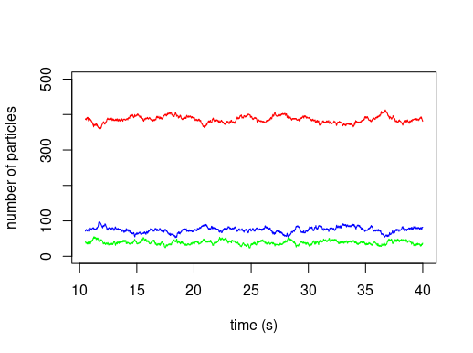

# Example file

A simple model containing three species (Aa, Bb and Cc) that diffuse in a cell geometry. the species Aa has a diffusion coefficient of 0.05 um^2/s, Bb of 0.5 um^2/s and Cc of 5 um^2/s. 

A particle of Aa type turns into a Bb type with a rate of 1 1/s (giving a dwell timer of 1 s), Bb type turn into Cc type with a rate of 0.2 1/s (giving a dwell time of 5 s) and Cc type turn into Aa type with a rate of 2 1/s (giving a dwell time of 0.5 s).

In the beginning there are 500 particles of the type Bb and the simulation run for 10.5 seconds (simulated time) to equilibrate the system, and then continue to run until 40 seconds (simulated time).

The geometry of the cell is divided into small cubes with sides of a length 0.01 um. The scale used for the coordinates are in cubes.

The model is executed with MesoRD:
> mesord "simple_model.xml" -i 1 -I 50 -c 0.02 -C -1 -E -p -g -t 40 -q 0.010 um -K -x 10.5 -w 0.0057

The previous script (done in R) calculated the diffusion coefficient (D), occupancy (pOcc) and dwell time (DT) of the different species. 

|    | Aa | Bb | Cc |
| :--- | :---: | :---: | :---: |
| D: | 0.04896215  +/-  0.04194442 | 0.4704988  +/-  0.3920336 | 4.052581  +/-  3.412058  |
| pOcc: | 0.1496561  +/-  0.01517208 | 0.7719849  +/-  0.01813377 | 0.07835896  +/-  0.0108372 |
| DT: | 0.9729788  +/-  0.9594374 | 4.174117  +/-  3.820611 | 0.519336  +/-  0.5402186 |

Generally, the diffusion coefficient is underestimated due to confinement effect while the dwell time is usually a bit underestimated due to that the previous script require a while event when calculating the dwell time, e.g. Aa -> Bb -> Cc would be required to calculate the dwell time of Bb.

The distribution of the different species is (Aa in blue, Bb in red and Cc in green):

The file geometry.txt is not included due to its large size.